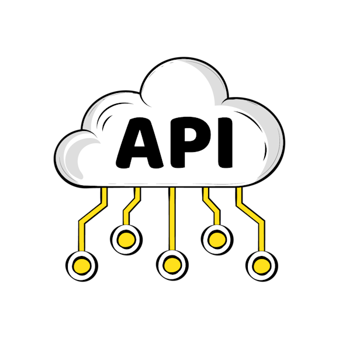

  <h1>👋 Hi, I'm Chandan Roy</h1>
  <h3>🚀 Flutter & Full-Stack Developer | Mobile & Web Solutions</h3>

  

    
    
    
    
  

  
  

    <b>Code that performs • Apps that scale • Experiences that matter</b>
  

---

### 📖 About Me
I am a passionate **Flutter and FlutterFlow Developer** specializing in building high-performance, scalable, and user-centric mobile and web applications. With a focus on **clean architecture** and **maintainable code**, I deliver secure and robust digital solutions that solve real-world problems.

- 🛠️ Expertise in **Cross-Platform** development (Android, iOS, Web).
- 🏗️ Depth in **Full-Stack** solutions with Firebase & RESTful APIs.
- 📍 Specialized in **Location-based services** and **Google Maps API** integrations.
- 🍽️ Experienced in building complex **ERP & Management Systems** (Restaurants, Travel, etc.).

---

### 🛠️ Tech Stack & Skills

  
  
  
  
  
  
  
  
  
  
  

---

### 📍 Advanced Integrations & Portfolio Highlights

<table align="center">
  <tr>
    <td align="center">
       
      <b>🔌 API</b>
    </td>
    <td align="center">
       
      <b>🗺️ Google Maps</b>
    </td>
    <td align="center">
       
      <b>💎 IAP</b>
    </td>
  </tr>
</table>

---

### 📊 GitHub Contributions

  

---

### 🚀 Hero Projects

---

#### 🎒 [Backpackr](https://github.com/roychandu/backpackr)
> **"Connect. Explore. Wander together."**
> A revolutionary social media ecosystem designed for solo travelers to share journey blogs and build genuine connections through real-time discovery.

- **Nearby Discovery**: Intelligent engine finding fellow travelers within a **200km radius**.
- **The "Wave" Mechanic**: A proprietary double-opt-in icebreaker system for frictionless networking.
- **Traveling Blogs**: High-fidelity multimedia storytelling with image carousels and distance tracking.
- **Meetup Orchestrator**: Full-lifecycle event management for public and private community gatherings.
- **Tech Stack**: `Flutter`, `Dart`, `Firebase Realtime Database`, `Geolocator`, `Google/Apple Auth`.

---

#### 📋 [TablePilot](https://github.com/roychandu/TablePilot)
> **"Frictionless Hospitality: From Floor to Kitchen."**
> A comprehensive, full-stack restaurant management platform that unifies reservations, live order tracking, and automated billing into a single mobile interface.

- **Live Reservation Grid**: Mathematical mapping of floor space with real-time occupancy tracking.
- **Smart Billing Engine**: Automated processing of service charges, tax, and multi-mode discounts.
- **Dynamic Menu Engine**: Categorized item management with resolution-aware image variants.
- **Staff Control Center**: Role-based access control (RBAC) specifically built for Admin vs. Staff workflows.
- **Tech Stack**: `Flutter`, `Riverpod`, `Firebase`, `In-App Purchases`, `GetX`.

---

#### 📅 Content Planner Plus
> **"The Smart Productivity Ecosystem for Modern Creators."**
> An all-in-one planning tool that bridges the gap between brainstorming ideas and professional content execution.

- **Intelligent Planner**: Visual calendar Integration for scheduling and tracking content lifecycles.
- **AI Idea Capture**: Direct speech-to-text integration for capturing inspiration on the fly.
- **Performance Analytics**: High-fidelity charts to track growth and engagement trends.
- **PDF Reporting**: Automated generation of content schedules and performance summaries.
- **Tech Stack**: `Flutter`, `Charts`, `PDF Generator`, `Speech-to-Text`, `Firebase`.

---

### 🎯 My Focus
- **Scalable Architectures** - Building for the future.
- **Clean Code** - Maintainability and security first.
- **Micro-Animations** - Creating delightful user experiences.
- **Performance Optimization** - Every millisecond counts.

---

### 📬 Let's Connect

  

  
  
  

---

  <i>"Code that performs. Apps that scale. Experiences that matter."</i>

